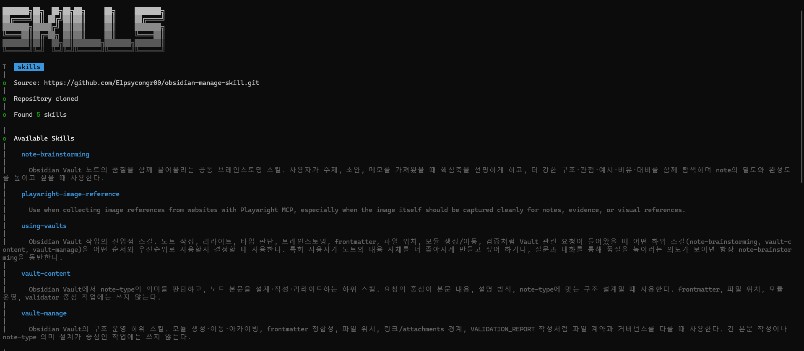
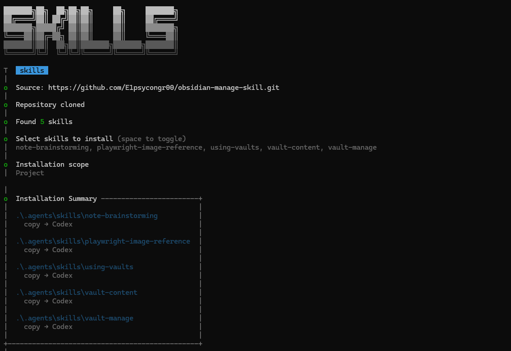

# Codex install

Use `npx skills` to install this repository's skills into Codex.

## Prerequirements

If `npx` does not work on your machine, install the prerequisites first:

- Node.js
- npm / `npx`

## Recommended

Installing all skills from this repository is recommended.

See all discoverable skills:

```bash
npx skills add E1psycongr00/obsidian-manage-skill --list --agent codex
```



Open the install selection for Codex and install all listed skills:

```bash
npx skills add E1psycongr00/obsidian-manage-skill --skill --agent codex
```



Install one specific skill only:

```bash
npx skills add E1psycongr00/obsidian-manage-skill --agent codex --skill vault-content
```
